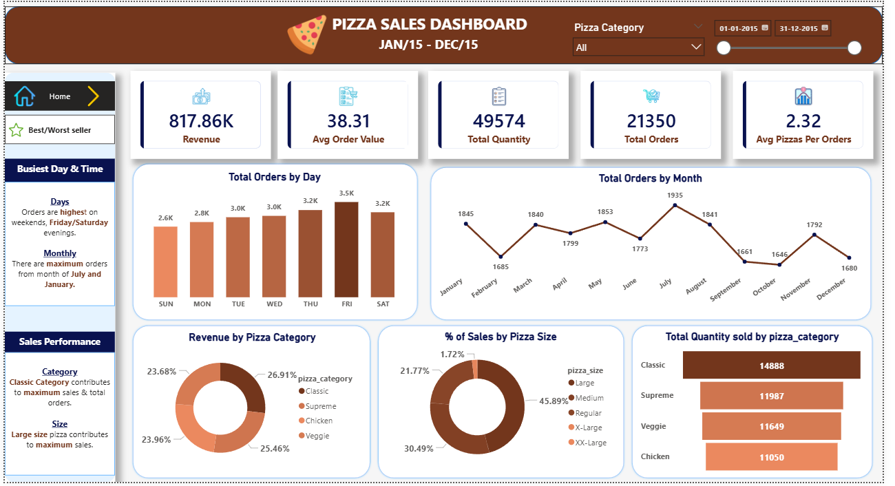
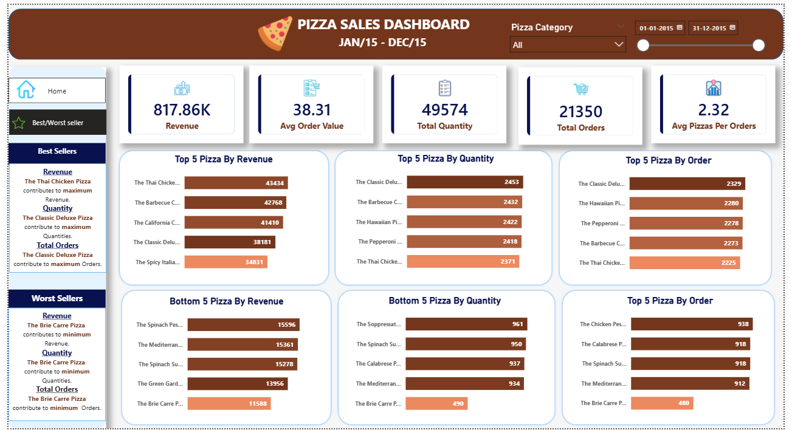

# -Pizza_Sales_Dashboard-_PowerBI_MySql_PowerQuery_Project

📌 Project Overview

This project is an end-to-end Business Intelligence solution built using Power BI and MySQL to analyze pizza sales data for the year 2015.

The objective of this dashboard is to uncover key business insights related to revenue performance, customer ordering behavior, product trends, and operational patterns.

🎯 Business Objectives

1.Track overall revenue and order performance

2.Identify peak sales days and months

3.Analyze category and size contribution to revenue

4.Determine top and bottom performing pizzas

5.Understand customer purchasing behavior

📊 Key Metrics

1.Total Revenue: 817.86K

2.Total Orders: 21,350

3.Total Quantity Sold: 49,574

4.Average Order Value: 38.31

5.Average Pizzas per Order: 2.32

🔎 Key Insights

1.Sales peak on Fridays and Saturdays, especially evenings.

2.Highest monthly orders recorded in July and January.

3.Classic category contributes the highest share of total sales.

4.Large size pizzas generate the most revenue.

5.Identified Top 5 and Bottom 5 pizzas by Revenue, Quantity, and Orders.

🛠 Tools & Technologies Used

1.Power BI Desktop

2.MySQL

3.DAX (Data Analysis Expressions)

4.SQL for Business Queries

5.Power Query for Data Cleaning & Transformation

📂 Project Structure

Pizza-Sales-Dashboard/

├── Raw_Data/                            # Original dataset

├── SQL_Queries/                       # Business SQL queries
    

├── PowerBI/                           # Power BI (.pbix) file

├── Images/                          # Dashboard screenshots

└── README.md  

📈 Dashboard Features

1.Interactive KPI Cards

2.Time-based trend analysis (Daily & Monthly)

3.Category and Size contribution analysis

4.Top & Bottom product ranking

5.Dynamic slicers (Date & Category)

6.Clean UI with navigation between pages

🚀 Skills Demonstrated

1.Data Modeling in Power BI

2.Advanced DAX Calculations

3.KPI Development

4.Ranking & Performance Analysis

5.SQL Integration with Power BI

5.Dashboard Design & Storytelling

📷 Dashboard Preview

